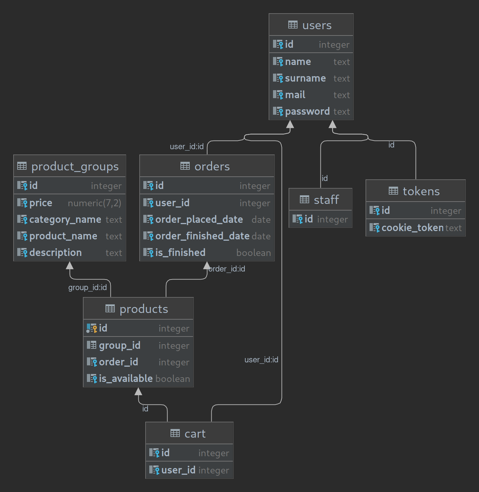

# php_shop

Simple shop app with crud interface and postgresql database behind.

App wrtiten in pure OOP PHP without any frameworks.
Uses simple css.

link: https://students.mimuw.edu.pl/~ms419409/

Features:
- Register new user.
- Login as user|admin
- Display shop, cart, orders contents
- Add products to cart
- Add products from cart to orders
- Password hashing in database
- Incrementing records in database
- Sustaining login status using cookie containing mail and user specific token
- Simple sql-injection defences
- All CRUD functionality: Displaying all tables, adding new records, updating records, deleteing records

Database structure

